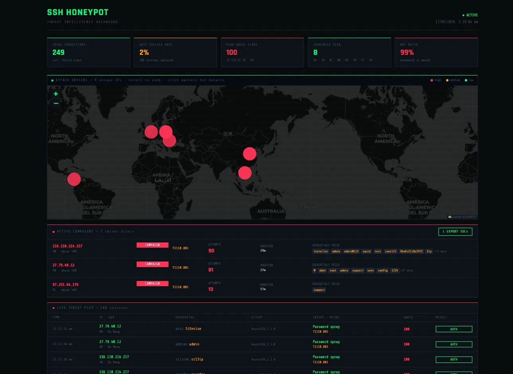
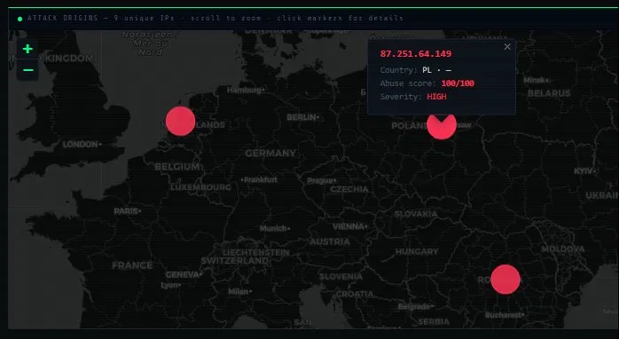
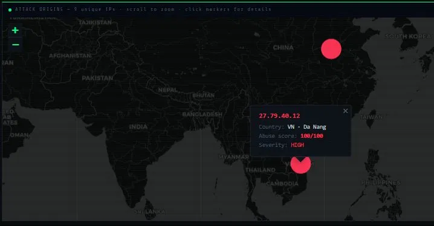
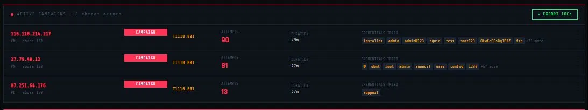
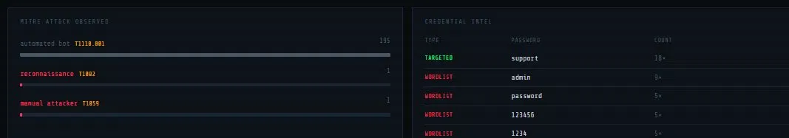
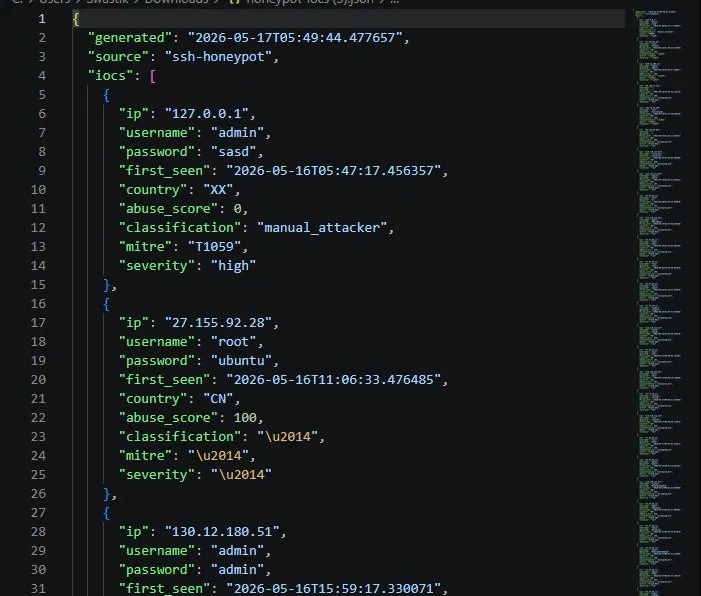

# SSH Honeypot — Threat Intelligence Dashboard

A production-grade SSH honeypot that captures real-world attack data, enriches it with threat intelligence, classifies attacker behaviour against the MITRE ATT&CK framework, and surfaces everything through a live React dashboard.

Built as a solo project running on a home network. Within 24 hours of deployment, it captured 256 connection attempts from 8 countries, identified 3 active attack campaigns, and logged 170+ unique credential pairs from known botnets.

---



---

## What it does

The honeypot presents a convincing fake Ubuntu 22.04 SSH server. When attackers connect, it:

- Accepts any username/password combination and drops them into a fake interactive shell
- Logs every connection attempt, credential pair, and command typed
- Enriches each attacker IP with GeoIP data and AbuseIPDB reputation scores
- Classifies sessions against MITRE ATT&CK techniques using a YAML rules engine
- Groups repeated attacks from the same IP into campaigns with duration and attempt counts
- Exports all indicators of compromise as structured JSON ready for SIEM ingestion

---

## Stack

**Backend**
- Python 3.12, paramiko (fake SSH server), FastAPI, SQLite
- structlog (JSON structured logging), geoip2, AbuseIPDB API
- WebSocket live feed, YAML-based classifier

**Frontend**
- React 18, TypeScript, Vite
- Framer Motion, react-leaflet, Recharts, Tailwind CSS

**Infrastructure**
- Docker Compose — single command deployment
- Persistent SQLite with volume mounts

---

## Dashboard

### Attack origins map

Interactive world map with clickable markers. Dot size scales with abuse score. Red = high severity (abuse >= 80), amber = medium, green = clean.





### Active campaigns

Groups repeated attacks from the same IP into structured campaigns showing attempt count, duration, MITRE technique, and every credential tried.



### Live threat feed

Real-time session table with GeoIP, credential tried, client fingerprint, classified intent, MITRE tag, and AbuseIPDB score per row.


### MITRE ATT&CK breakdown and credential intel

Attack technique distribution and password classification (wordlist / default credentials / targeted).



### IOC export

One-click export of all malicious IPs, credentials, MITRE tags, and severity ratings as structured JSON ready for firewall or SIEM ingestion.



---

## Real findings — 24 hours of data

| Metric | Value |
|--------|-------|
| Total connection attempts | 256 |
| Sessions captured | 212 |
| Auth success rate | 2% |
| Countries seen | 8 (AU, CN, NL, MW, RO, VN, PL, PA) |
| Bot ratio | 99% |
| Peak abuse score | 100/100 |
| Unique credential pairs | 170+ |

**Campaign 1 — Vietnamese AsyncSSH botnet**

Two IPs (`116.110.214.217` and `27.79.40.12`) running coordinated credential stuffing using AsyncSSH 2.1.0. 171 attempts in 29 minutes across a full dictionary including default router credentials, IoT defaults (`pi:raspberry`, `root:bananapi`), and enterprise service accounts (`nagios:nagios`, `tomcat:tomcat`). Classified as T1110.001 Password Spraying.

**Campaign 2 — Polish Go botnet**

`87.251.64.176` making repeated attempts every ~4 minutes with a single credential pair (`support:support`) over 88 minutes. Consistent interval suggests automated retry logic with backoff. Classified as T1110.001.

**Campaign 3 — Chinese root:ubuntu probe**

`27.155.92.28` (AbuseIPDB score 100, 2,021 prior reports) attempting `root:ubuntu` — a common default on DigitalOcean and Linode VPS instances. Disconnected immediately after authentication, consistent with automated shell detection evasion.

**Key finding:** 98% of connection attempts never completed the SSH handshake — pure port scanners fingerprinting the service. Of those that authenticated, 100% were automated bots. No human attacker ran commands on the fake shell.

---

## Architecture

```
internet
    |
    v port 22 (router forwards to 2222)
+------------------+
|  paramiko SSH    |  fake shell, accepts all creds
|  server.py       |  logs every keystroke
+--------+---------+
         |
         v
+------------------+     +--------------+     +-------------+
|  SQLite DB       |     |  GeoIP2      |     |  AbuseIPDB  |
|  sessions        |     |  MaxMind     |     |  API        |
|  commands        |<----|  City DB     |     |             |
|  enrichment      |     +--------------+     +-------------+
|  classifications |
|  connections     |
+--------+---------+
         |
         v
+------------------+
|  FastAPI         |  REST + WebSocket
|  api.py          |  /sessions /stats /campaigns /iocs/export
+--------+---------+
         |
         v
+------------------+
|  React +         |  live map, campaign panel
|  TypeScript      |  threat feed, MITRE chart
|  frontend        |  IOC export
+------------------+
```

---

## MITRE ATT&CK coverage

| Technique | ID | Observed |
|-----------|-----|---------|
| Password Spraying | T1110.001 | 194 sessions |
| Credential Stuffing | T1110.004 | detected |
| Command and Scripting Interpreter | T1059 | manual sessions |
| System Information Discovery | T1082 | whoami, id, uname |
| Valid Accounts | T1078 | fallback classification |

---

## Running locally

### Prerequisites

- Docker Desktop
- MaxMind GeoLite2-City.mmdb (free account at maxmind.com)
- AbuseIPDB API key (free at abuseipdb.com)

### Setup

```bash
git clone https://github.com/swasctl/ssh-honeypot.git
cd ssh-honeypot

# Copy and fill in your keys
cp backend/.env.example backend/.env
# Add: ABUSEIPDB_API_KEY=your_key_here

# Add GeoLite2-City.mmdb to backend/data/

# Start everything
docker-compose up --build
```

Dashboard: http://localhost:5173
API: http://localhost:8000
Honeypot: port 2222

### Port forwarding — to capture real attacks

Forward external port 22 to internal port 2222 on your router. Automated scanners will find the open port within 30 to 60 minutes.

---

## Project structure

```
ssh-honeypot/
├── backend/
│   ├── server.py           entry point
│   ├── api.py              FastAPI app
│   ├── ssh/
│   │   ├── handler.py      paramiko server + client handler
│   │   ├── filesystem.py   fake shell commands
│   │   └── session.py      session state
│   ├── db/
│   │   ├── database.py     schema + connection
│   │   └── queries.py      all DB operations
│   ├── core/
│   │   ├── classifier.py   MITRE rules engine
│   │   ├── enrichment.py   GeoIP + AbuseIPDB
│   │   ├── rules.yaml      classification rules
│   │   └── config.py       environment config
│   └── routers/
│       ├── sessions.py     session endpoints
│       └── stats.py        stats endpoint
├── frontend/
│   └── src/
│       ├── components/
│       │   ├── ThreatMap.tsx
│       │   ├── ThreatFeed.tsx
│       │   ├── CampaignPanel.tsx
│       │   ├── MitreChart.tsx
│       │   ├── CredentialIntel.tsx
│       │   ├── ConnectionsTable.tsx
│       │   └── SessionDrawer.tsx
│       └── api.ts
├── docs/screenshots/
├── docker-compose.yml
└── README.md
```

---

## Known limitations

- Honeypot accepts all SSH key-based auth attempts (paramiko limitation)
- GeoIP accuracy varies — residential IPs often resolve to city level only
- MITRE classification is rule-based, not ML — complex multi-stage attacks may be misclassified
- SQLite is suitable for single-node deployment; replace with Postgres for multi-instance
- Automated bots disconnect immediately after auth without running commands, making duration-based human detection unreliable at low session counts

---

*Built by Swastik Malhotra — Melbourne, AU*